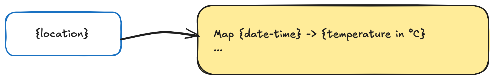

# Data

The data model of the sample is:



**location** are the Durable Object id's, e.g. 

- `Helsinki`
- `London`

This is naïve, of course, but "good enough" for a demo.

Each location thus has their own Durable Object instance, and can run independently.

**Map of date/temperature values** is currently the only data stored. We don't really focus on how this is stored in the SQLite. The point is in testing out APIs and persistence.


## APIs

### POST on `/{location}`

Write one or more data.

body (JSON array):

```
[
  { when="..data as ISO8601 zoneless..", temperature_c=<float> }
  [...]
]
```


### GET on `/{location}`

List all the data available on that location (error code `xxx` if location unknown), as a JSON array:

```
[
  { when="..data as ISO8601 zoneless..", temperature_c=<float> }
  [...]
]
```

>We'll output in ascending order, but this can be made more explicit by settings query parameters. Not important for the proof-of-concept.


## Storage

The `when` will be stored in SQLite (Durable Objects) as an integer - UNIX epoch *seconds*.

