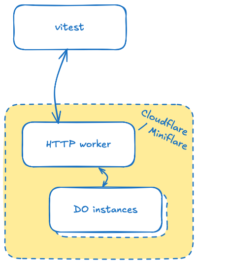

# Testing

We test the Durable Object's behaviour in Node, using `vitest`.

This is because of `workers-rs` only providing access to the Durable Objects via a proxy (in JS/TS, Cloudflare infrastructure also provides *direct* access to them). 

Thus, using something like `@cloudflare/vitest-pool-workers` (which "runs tests within the workers"), does not seem to provide *any* added benefit over plain `vitest`.

In addition, sticking to plain `vitest` - or any HTTP testing framework - reduces the learning threshold for maintaining a project!

